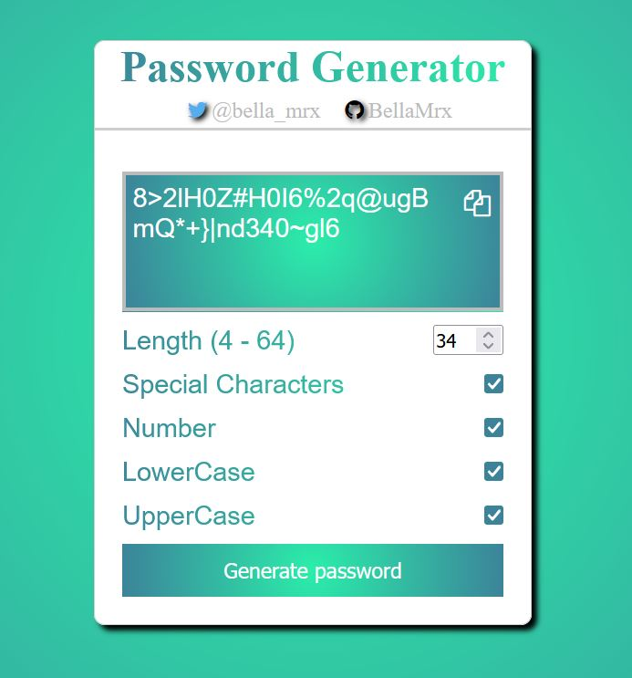
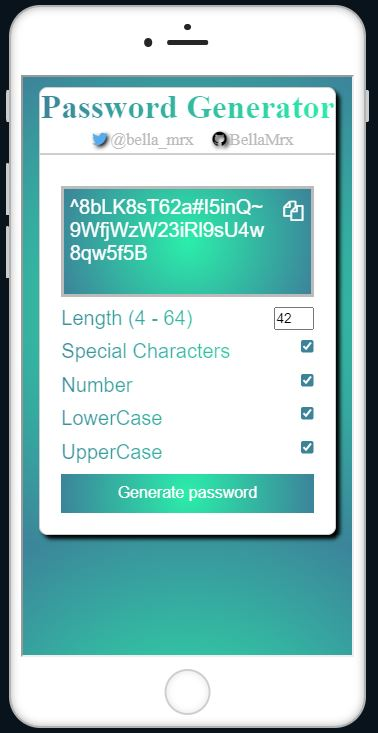

# Password_Generator

 generates a password according to user's request (only in HTML, CSS, JS)

 Save the files in a folder and open the file "index.html" in your browser.

 Video on [YouTube](https://youtu.be/8j6uFx2THZ4)

 

 Mobile View
 