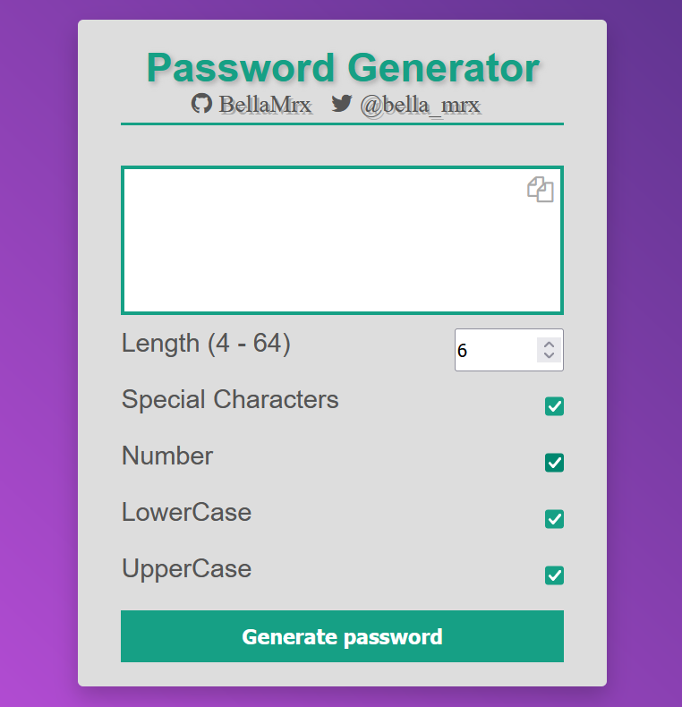
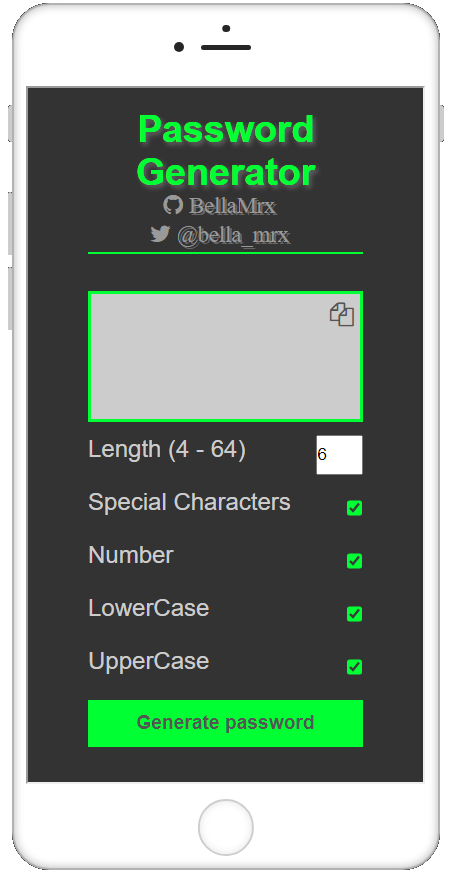

# Password_Generator

 generates a password according to user's request, build with JavaScript, HTMl, CSS.
 
 Try out the Password generator here [book-of-coding.com](https://book-of-coding.com/build_projects.html#password-generator)

 Preview

 

 Preview mobile view

 